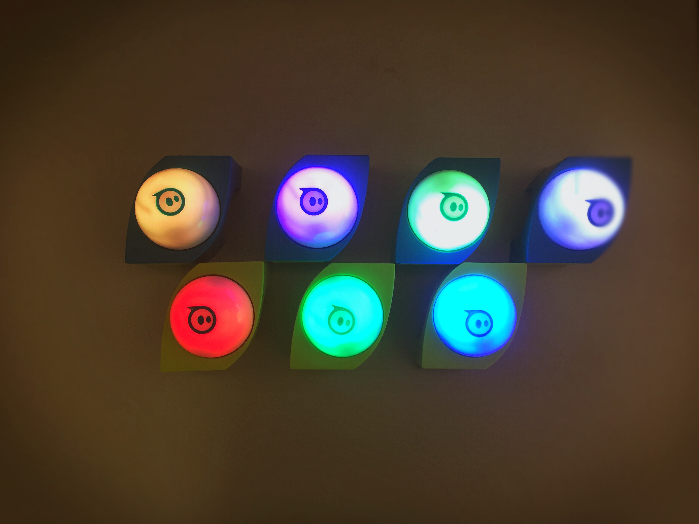

# SpheroTeam



A Python library for controlling multiple Orbotix [Sphero](http://www.sphero.com/) robots. 

Key functionalities include:

- Functions for managing connection, identification, and status of Spheros
- Choice of P and PID Control for Cartesian Grid based navigation
- Automatic calibration of robot orientation relative to camera
- Functions for near-simultaneous control of multiple Spheros without camera
- Functions for serial control of multiple Sphero with camera

Some demo code is provided that can be used to construct a strategy for coordinated 
block pushing using multiple Spheros. This is a task that individual Spheros cannot achieve, but
multiple Spheros can accomplish together! You can use the library to control up to 7 Sphero 
devices at once, as that is a limitation of this communication protocol.

Videos, pictures, and paper will be uploaded soon.

## Usage

First, review [setup.md](./documentation/setup.md) to install the necessary dependencies.

Note that we have modified the [base Sphero NAV](https://github.com/Tordensky/SpheroNav) library, which is not under active maintenance by the original developer. Be sure to have [this fork](https://github.com/hydrosquall/spheronav) on your computer!

To use the SpheroTeam library with Sphero NAV, add the SpheroTeam folder to your Python path as well. Then you can start any sphero project with the following imports:

```
    import sphero
    import SpheroTeam
```

See [notebooks](./notebooks) files to see the steps that led to the development
of the SpheroTeam library, as well as example usage of most of the important APIs in notebook 10.

### Requirements

See [notebooks](./notebooks) for code examples. Other things that are needed:

- Logitech C920 Webcam mounted overhead with bird's eye perspective and moderate lighting.
- If using the webcam picker applet doesn't work for you, you may need to pass in a 
device ID to your `ColorTracker()` object. (This is different from how original Sphero NAV is used).
- Computing device that supports bluetooth
- A flat room surface for the spheros to operate in: we currently do not officially
support uneven surface control.

Configuration files `config.json` and `roster.json` will simplify your life tremendously. You can use the Sphero official app to get the MAC addresses and Bluetooth names of your devices. The device ID issue with the camera described above can also be handled using a key in your config file. Examples of both configuration files are provided in this repository's root.

It is possible to connect with new Spheros using discovery mode, but this author found
doing so to be much slower and error prone, therefore I recommend using a `roster.json` whenever possible.

Tracking Spheros is limited by the quality of lighting in the room and your camera's sensitivity to different colors. More work can be done to improve the image filters.

### Sphero Care

- Spheros are officially rated for 1 hour of playtime on full charge, but
if you're not driving them continuously, you can make them last longer.
- Spheros will automatically turn off when their voltage dips below 7.0 V. The robot will flash red to let you know that this is about to happen.
- Spheros cannot be overcharged, according to [Sphero FAQ](https://support.sphero.com/support/discussions/topics/9000016308) the chargers automatically shut off when the battery is full.
- The best way to turn off a Sphero is to put it while it is still on, on top of the charging base. When the Sphero wiggles into position and flashes rainbow colors, it will lock and turn off right afterwards.
- If you are managing a Sphero team, I recommend labeling their plastic bases, and using them as "hats" for the robots as they sit in their chargers. (Add picture).

### Troubleshooting Tips

- If your camera is mounted sufficiently high, your video may snap in and out of focus. Logitech allows you to disable autofocus on your web camera after installing the "Logitech Gaming Software" app, under the advanced settings.
- Bluetooth communication fails when the robots run out of power / when packets are lost to interference. If a robot stops responding, disconnecting and reconnecting to it usually fixes the problem.
- When calibrating, start with all robots near the center of the camera's range. You may want to place them in the center of the room one at a time to preven them from bumping into each other during the calibration step.

### Context
Developed at Yale University's [Scazlab](http://scazlab.yale.edu/) for CPSC 473 Intelligent Robotics Laboratory in Spring 2017, using lab facilities and equipment. We tested 
our application with the Sphero 2.0 model, running firmware version 3.90+.
